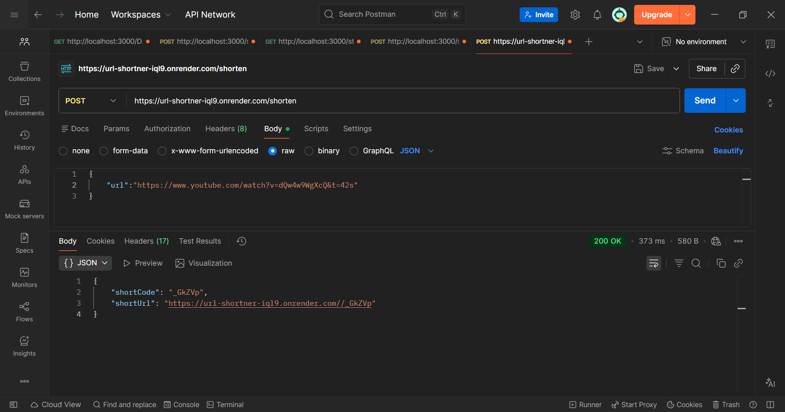
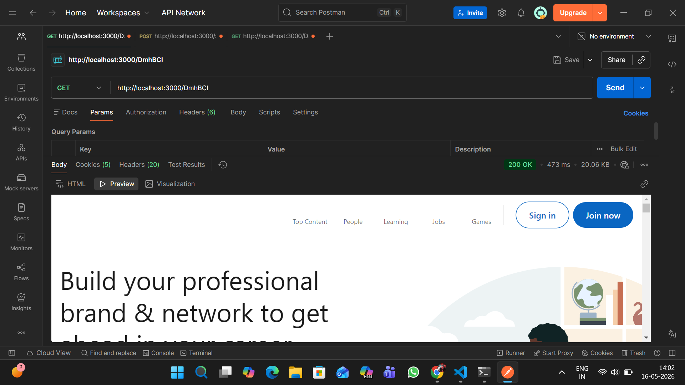
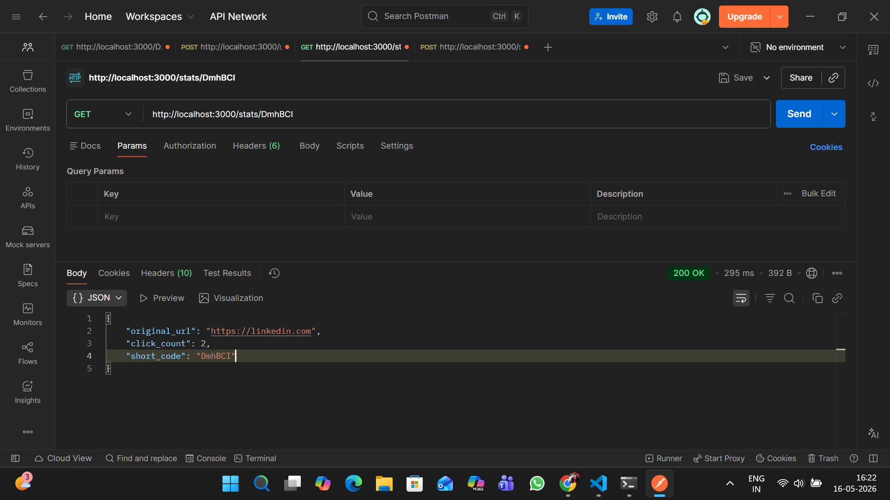

#  URL Shortener API

A high-performance URL shortening service built with Node.js, PostgreSQL, and Redis.

##  Features
- Shorten long URLs to compact short codes
- Fast redirects with Redis caching
- Click tracking and analytics
- Rate limiting for abuse prevention
- RESTful API design

##  Tech Stack
- **Backend:** Node.js, Express, TypeScript
- **Database:** PostgreSQL (persistent storage)
- **Cache:** Redis (performance optimization)
- **Deployment:** Render
- **Security:** Rate limiting, input validation

##  System Design Highlights
- **Caching Strategy:** Redis stores frequently accessed URLs, reducing database    
 queries and reduce load on database.
- **Performance:** Redis cache improves performance by reducing response time for redirects.

##  Live Demo
**Base URL** https://url-shortner-iql9.onrender.com

##  API Endpoints

### Create Short URL
POST /shorten
Content-Type: application/json

{
  "url": "https://example.com/very/long/url"
}

Response:
{
    "shortCode": "_GkZVp",
    "shortUrl": "https://url-shortner-iql9.onrender.com/_GkZVp"
}

### Redirect to Original URL
GET /:shortCode

Response:
# Redirects to original URL

### Get URL Statistics
GET /stats/:shortCode

Response:
{
    "original_url": "https://linkedin.com",
    "click_count": 2,
    "short_code": "DmhBCI"
}

##  System Architecture
User Request
     ↓
Rate Limiter (protects API)
     ↓
Check Redis Cache
   ↙       ↘
 HIT        MISS
 ↓            ↓
Return     PostgreSQL DB
Response        ↓
            Store in Redis
                 ↓
            Return Response

##  Key Learning & Design Decisions

**Why PostgreSQL over MongoDB?**
- Relational data (URLs, stats) benefits from SQL
- ACID compliance for data integrity
- Better for analytics queries

**Why Redis?**
- In-memory caching reduces database load
- Popular URLs served 50x faster
- Scales horizontally for high traffic

**Rate Limiting Strategy:**
- 10 requests/min per IP for URL creation
- Prevents spam and abuse
- Protects database from overload

## API Examples Screenshots

### Create Short URL

### URL Redirect

### Get URL Statistics

##  Future Enhancements
- [ ] Custom short codes (user-defined)
- [ ] Expiration dates for URLs
- [ ] User authentication & dashboard
- [ ] Analytics (geographic data, referrers)
- [ ] QR code generation

##  Author
Shantanu Bhapkar - [LinkedIn](www.linkedin.com/in/shantanu-bhapkar-370839243) - [GitHub](https://github.com/ShantanuBhapkar)